# IF3210-2022-Unity-67

Tugas Besar IF3210: Unity3D Survival Shooter

## Deskripsi Aplikasi

Aplikasi permainan Survival Shooter Extended merupakan standalone game yg dibangun dari permainan Survival Shooter Unity. Terdapat dua game mode dalam permainan ini, 1 Survival Mode dan 2 Zen Mode.

Pada survival mode pemain diharapkan untuk bertahan hidup selama-lamanya selama permainan berlangsung. Perhitungan score berdasarkan lamanya pemain bertahan hidup;

Pada Zen Mode, pemain dihadapkan dengan wave yang harus dikalahkan, terdapat juga Boss yang harus dikalahkan setiap 3 wave. Perhitungan score didapatkan dari monster yang dibunuh.

Terdapat 6 jenis monster dalam game:
1. Zombunny
2. Zombear
3. Hellephant
4. Skeleton
5. Bomber
6. Boss

## Library

- Unity
- TMP (bawaan unity) untuk text

## Screenshot Aplikasi
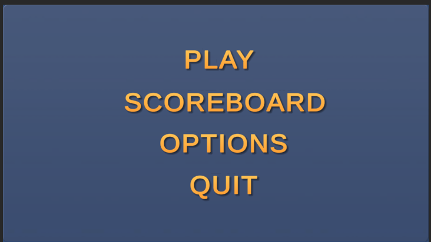

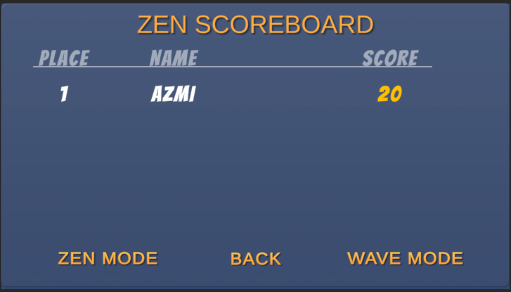
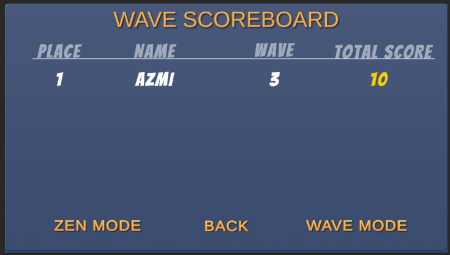

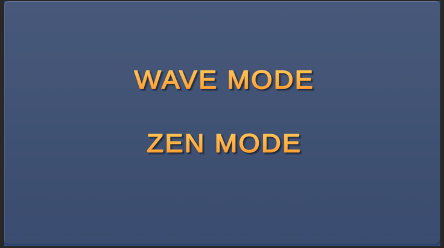
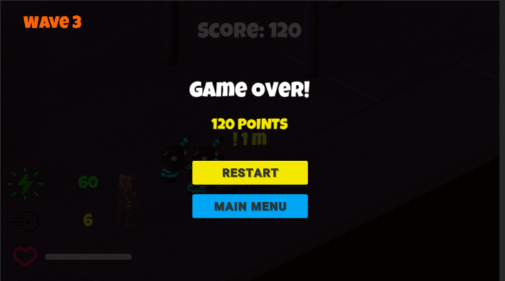
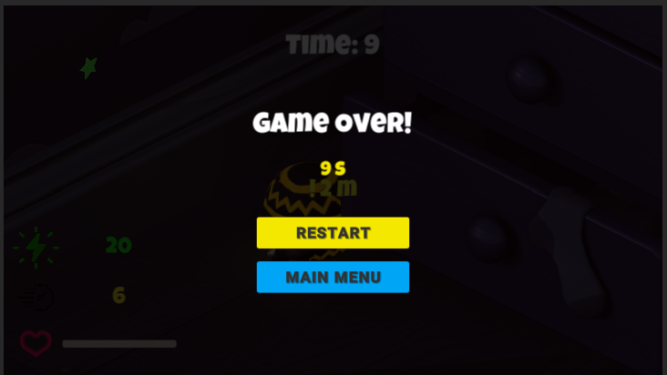
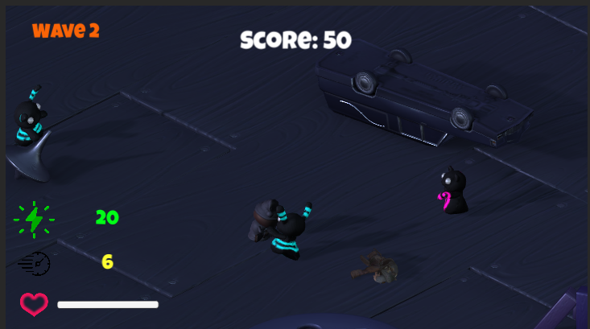
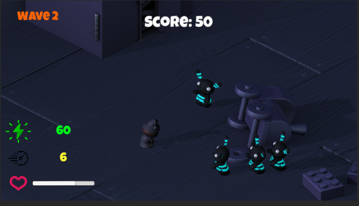
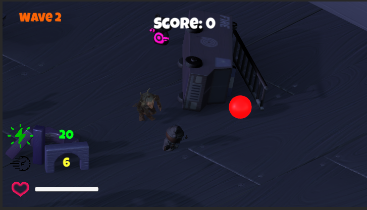
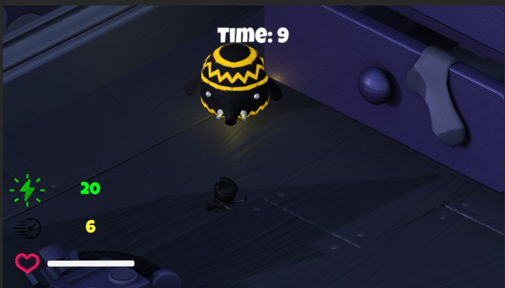
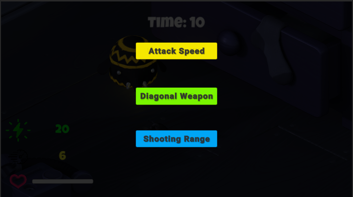
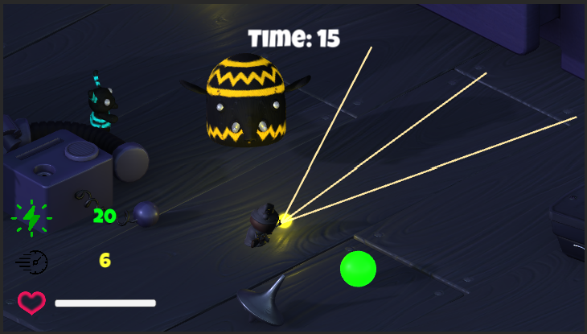

## Pembagian Kerja
- Juan Louis Rombetasik (13519075): implementasi weapon upgrade, wave mode, zen mode, dan additional mobs
- Aria Bachrul Ulum Berlian (1519115): implementasi orb, model, serta animasi
- Azmi Muhammad Syazwana (13519151): implementasi main menu, game over, scoreboard, dan menampilkan attribute player